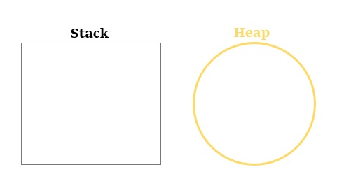
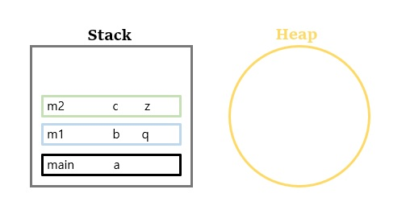
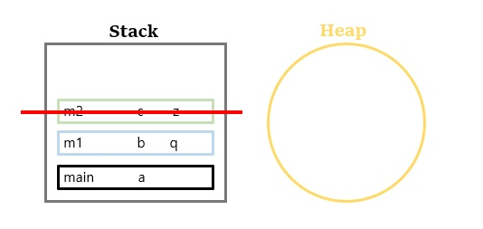
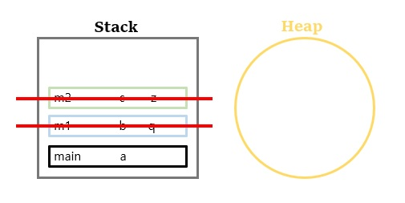
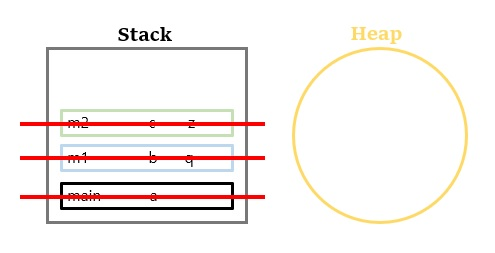
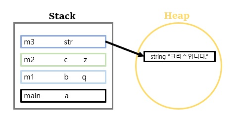
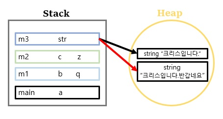
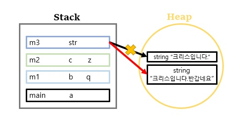
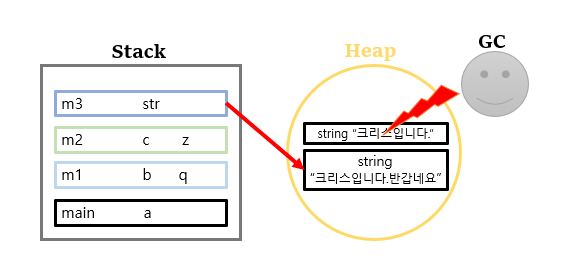
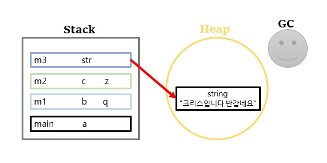

# Stack & Heap in Java

---

## Stack
- Stack 에는 heap 영역에 생성된 Object 타입의 데이터들에 대한 참조를 위한 값들이 할당된다.
- 원시 타입(primitive types)(byte, short, int, long, double, float, boolean, char)의 경우 실제 데이터 값이 할당된다.
- 해당 method가 호출되면 메모리에 할당되고 method가 종료되면 메모리가 해제된다.

```java
public class Main{
    public static void main(String[] args) {
        int a;
        m1();
    }

    public static void m1() {
        int b;
        doublc q;
        m2();
    }

    public static void m2() {
        int c;
        boolean z;
    }
}
```
1. main 메서드 호출되면 아래와 같이 Stack에 쌓인다.
   <br/>
   <br/> 
2. main 메서드 호출이 끝나고 Stack은 **후입선출 구조** 기 때문에 아래와 같이 Stack의 할당된 값들이 종료가 된다.
   <br/>
   <br/>
   <br/>
- 메소드가 종료되면 자동으로 메모리가 종료된다.
--- 
## Heap
- Heap 영역에는 대체로 생명주기가 긴 데이터가 저장된다.
- 모든 Object type(String, ArrayList, HashMap, Inteter, etc...)의 데이터가 저장되는 영역이다.

```java
public class Main{
    public static void main(String[] args) {
        int a;
        m1();
    }

    public static void m1() {
        int b;
        doublc q;
        m2();
    }

    public static void m2() {
        int c;
        boolean z;
        m3();
    }

    public static void m3() {
        String str = "크리스입니다.";
        str += "반가워요";
    }
}
```
1. m3의 메소드가 호출된다.
   <br/>
2. m3의 str은 초기화를 2번 하는 구조이다. 마지막으로 선언된 str을 reference 하게 된다.
   <br/>
3. Stack에 str라는 이름으로 생성된 변수는 할당된 값을 가지고 있는게 아니라 Heap의 선언된 string을 reference 한다.
   <br/>
4. 위와 같이 Heap에서 String : "크리스입니다"는 unreachable object(어떤 변수도 reference 하고 있지 않는 객체)이다.
5. 그렇기 때문에 메모리 누수가 발생하여 JVM의 GC가 동작하여 unreachable object를 제거한다.
  <br/>
  <br/>
