# 객체지향프로그래밍1

1단원에 이어 이번 단원에서도 JVM에 대한 설명이 나왔습니다.

JVM이 **Java Byte Code 를 운영체제에 맞게 해석해주는 역할**인건 알겠는데 대체 객체지향프로그래밍 파트에  ****왜 또 나오는지 JVM을 총 정리하는 시간을 가지도록 하겠습니다.

# JVM

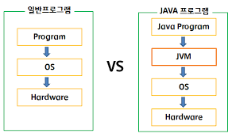

JVM이 뭐였는지 간단하게 1단원 내용을 상기시켜보겠습니다.

프로그램을 실행하는 것은 결국 컴퓨터입니다. 다시 말해 우리가 짠 코드를 컴퓨터가 알아들을 수 있어야하는데

자바의 경우, 컴퓨터가 이해할 수 있는 형태로 바꿔주는 번역기 역할을 하는게 **JVM**입니다.

그리고 JVM이 이해할 수 있는 형태가 바이트 코드, (.class)파일 입니다.

JVM에 대해 더 들어가보겠습니다.

# JVM 구성요소

JVM은 크게 네가지 구성 요소를 가집니다.

1. Class Loader

2. GC (Garbage Collector)

3. Execution Engine

**4. Runtime Data Area → 책에서 나온 메모리 영역이 이 부분입니다.**


1. 자바로 개발된 프로그램을 실행하면 JVM은 OS로부터 메모리를 할당합니다.
2. 자바 컴파일러(javac)가 자바 소스코드(.java)를 자바 바이트코드(.class)로 컴파일합니다.
3. Class Loader를 통해 JVM Runtime Data Area로 로딩합니다.
4. Runtime Data Area에 로딩 된 .class들은 Execution Engine을 통해 해석합니다.
5. 해석된 바이트 코드는 Runtime Data Area의 각 영역에 배치되어 수행하며 이 과정에서 Execution Engine에 의해 GC의 작동과 스레드 동기화가 이루어집니다.

## 클래스 로더(class Loader)

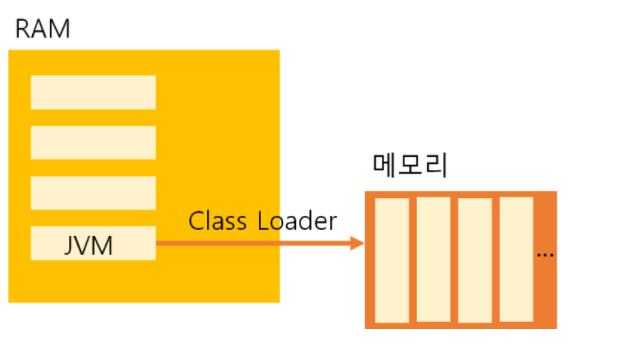

자바는 동적으로 클래스를 읽어오므로, 프로그램이 실행 중인 런타임에서야 모든 코드가 자바 가상 머신과 연결됩니다. 이렇게 동적으로 클래스를 로딩해주는 역할을 하는 것이 바로 클래스 로더(class loader)

자바에서 소스를 작성하면 .java파일이 생성되고 .java소스를 컴파일러가 컴파일하면 .class파일이 생성되는데 클래스 로더는 .class 파일을 묶어서 JVM이 운영체제로부터 할당받은 메모리 영역인 Runtime Data Area로 적재합니다.

## 실행 엔진(Execution Engine)

앞서 말씀드렸듯 클래스 로더에 의해 JVM으로 로드된 .class 파일(바이트코드)들은 Runtime Data Areas의 Method Area에 배치되는데, 배치된 이후에 JVM은 Method Area의 바이트 코드를 실행 엔진(Execution Engine)에 제공하여, 정의된 내용대로 바이트 코드를 실행한다.

이때, 로드된 바이트코드를 실행하는 런타임 모듈이 실행 엔진(Execution Engine)입니다. 실행 엔진은 바이트코드를 명령어 단위로 읽어서 실행!

## ****가비지 컬렉터(Garbage Collector)****

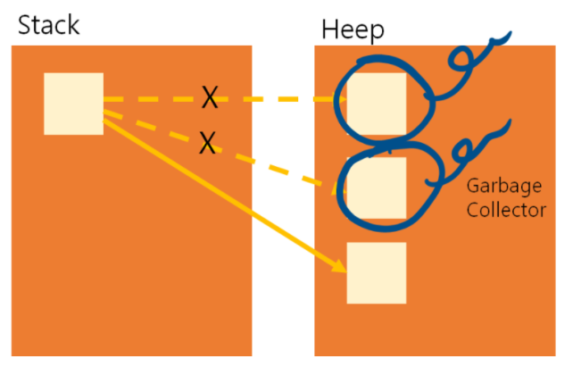

자바 가상 머신은 가비지 컬렉터(garbage collector)를 이용하여 더는 사용하지 않는 메모리를 자동으로 회수해 줍니다. 따라서 개발자가 따로 메모리를 관리하지 않아도 되므로, 더욱 손쉽게 프로그래밍을 할 수 있도록 도와줍니다. Heap 메모리 영역에 생성(적재)된 객체들 중에 참조되지 않은 객체들을 탐색 후 제거하는 역할을 하며 해당 역할을 하는 시간은 정확히 언제인지를 알 수 없습니다. GC역할을 수행하는 스레드를 제외한 나머지 모든 스레드들은 일시정지상태가 됩니다.

<aside>
💡 사실 위에 내용은 책에나온 내용은 아닙니다. 따라서 이게 뭔소리야? 정상입니다. 다음 내용부터는 책에 나온 내용이기 때문에 책에 있는 기본지식을 상기하면서 이해하시면 좋을 거 같습니다.

</aside>

## ****런타임 데이터 영역 (Runtime Data Area) → 261p JVM 메모리 구조****

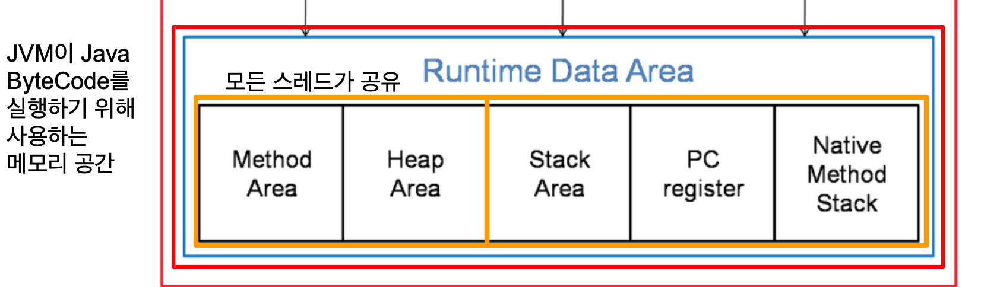

1.  **Method area - 클래스에 대한 정보를 저장**

모든 쓰레드가 공유하는 메모리 영역입니다. 메소드 영역은 클래스, 인터페이스, 메소드, 필드, Static 변수 등의 바이트 코드를 보관합니다.

**2. Heap area - 인스턴스가 생성되는 공간**

모든 쓰레드가 공유하며, new 키워드로 생성된 객체와 배열이 생성되는 영역입니다. 또한, 메소드 영역에 로드된 클래스만 생성이 가능하고 Garbage Collector가 참조되지 않는 메모리를 확인하고 제거하는 영역입니다.

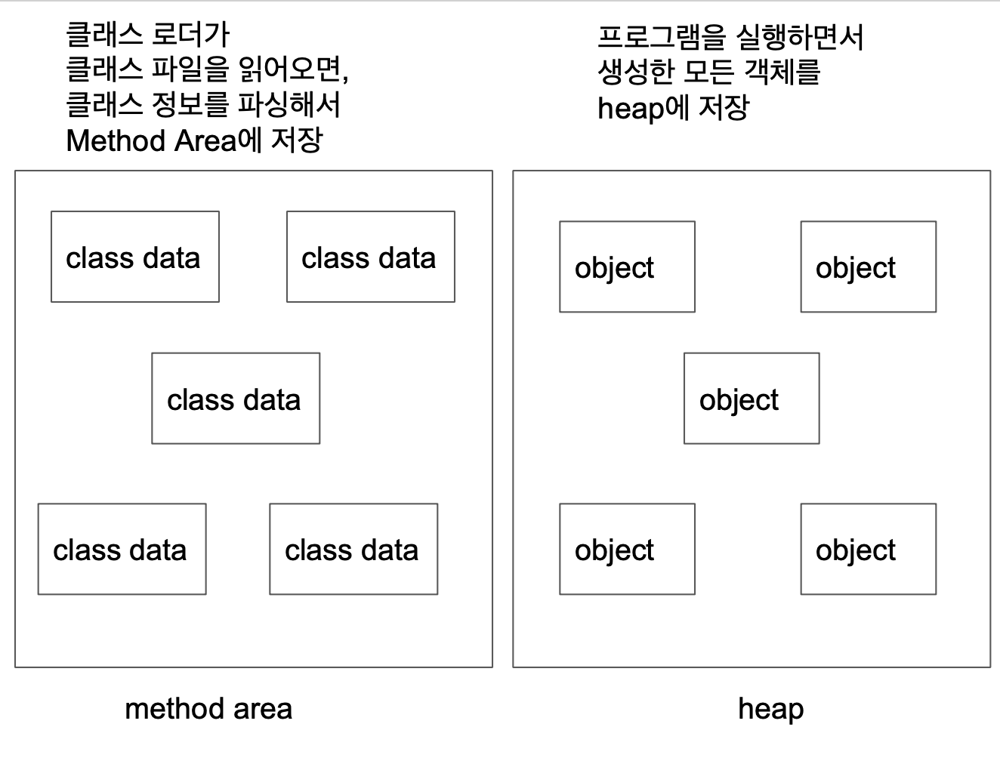

1. **Stack area - 메서드 작업에서 필요한 메모리 공간 제공**

메서드 호출 시마다 각각의 스택 프레임(그 메서드만을 위한 공간)이 생성합니다. 그리고 메서드 안에서 사용되는 값들을 저장하고, 호출된 메서드의 매개변수, 지역변수, 리턴 값 및 연산 시 일어나는 값들을 임시로 저장합니다. 마지막으로, 메서드 수행이 끝나면 프레임별로 삭제합니다.

**4. PC Register**

쓰레드가 시작될 때 생성되며, 생성될 때마다 생성되는 공간으로 쓰레드마다 하나씩 존재합니다. 쓰레드가 어떤 부분을 무슨 명령으로 실행해야할 지에 대한 기록을 하는 부분으로 현재 수행중인 JVM 명령의 주소를 갖습니다.

**5. Native method stack**

자바 외 언어로 작성된 네이티브 코드를 위한 메모리 영역입니다.

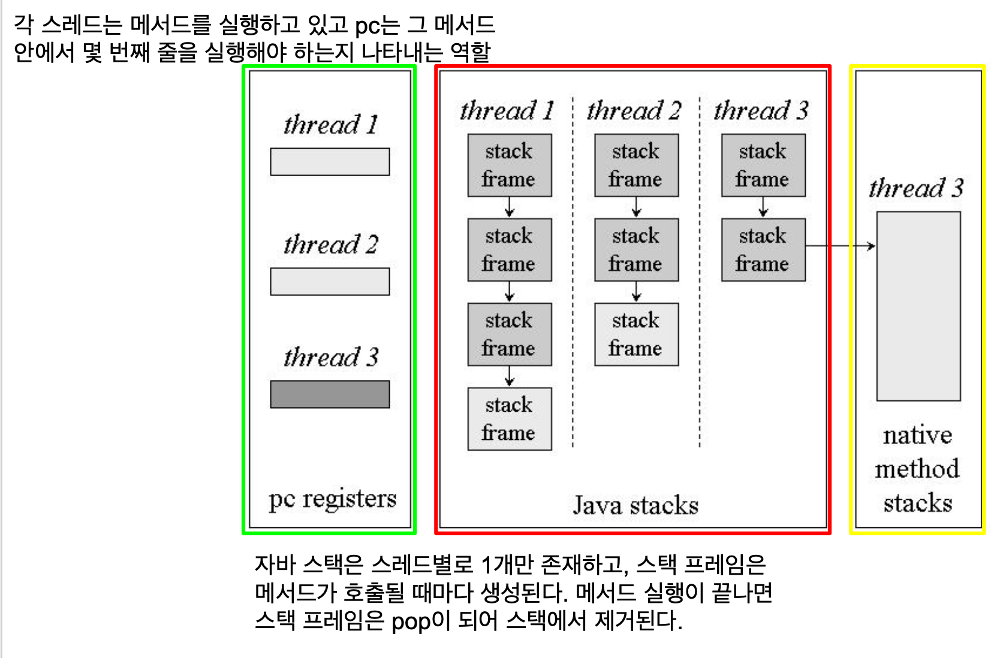
책에 나온 스택 영역을 보여주는 예시입니다.

main() push → firstMethod() push→ secondMethod() push→println() push→ println() pop →

secondMethod() pop → firstMethod() pop→ main() pop → 종료

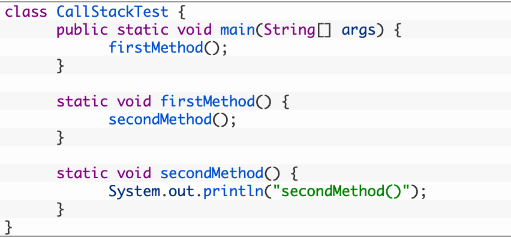

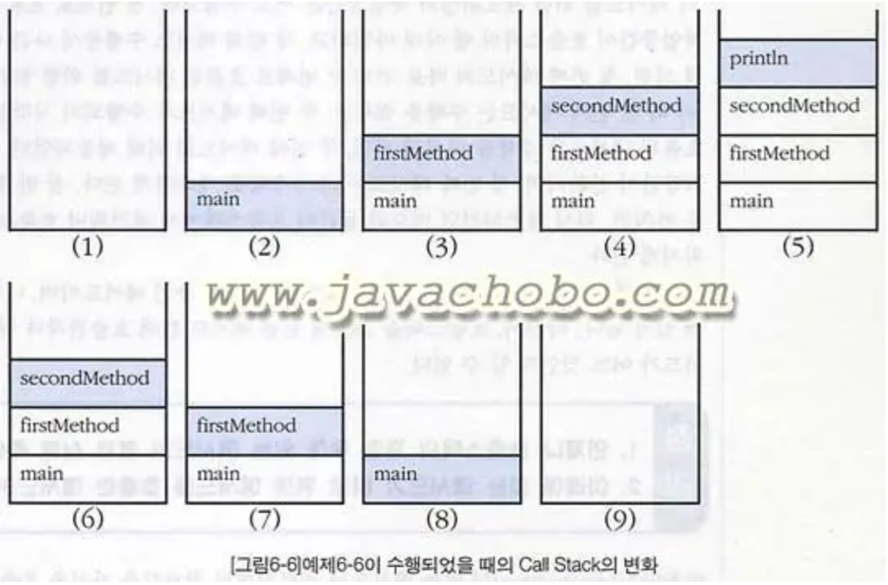
본격적으로 예시를 살펴보기 전에 책에 있는 선언위치에 따른 변수의 종류를 상기 시켜보겠습니다!!

왜냐면 변수의 종류에 따라 저장되는 메모리 위치가 다르기 때문입니다.

## 선언위치에 따른 변수의 종류

```java
class Variables{
	int iv; //인스턴스 변수
	static int cv; //클래스변수(static 변수, 공유 변수)

	void method(){
		int lv=0; //지역변수
	}
}
```


클래스 변수 → Method Area

인스턴스 변수 → 힙

지역 변수 → 스택

## 실행 예제

먼저 Method Area에 바이트 코드를 쭉 읽어서 분석합니다. → 클래스 정보, 메서드 정보, 정적(static)변수를 올림 →

처음으로 해석할 부분은 public static void main(String[] args){ 입니다.

main()메서드가 stack에 스택프레임으로 push 즉, 생성됩니다.

String[] args 또 한, 생성된 인스턴스 변수이기 때문에 heap에 null로 값이 올라갑니다.(초기화 x)

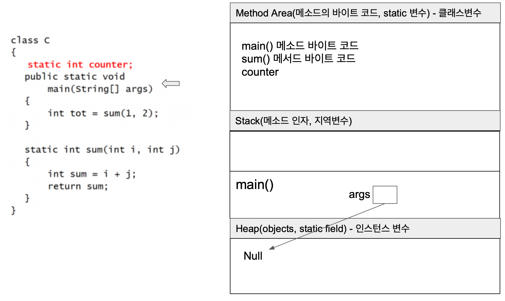

`int top = sum(1,2)` 를 해석합니다.

대입연산자는 오른쪽 부터 읽습니다.

sum(1,2)를 실행하기 위해 sum()메서드를 스택 프레임으로 할당합니다.

sum()메서드 안에 지역변수 int i, int j가 생성되고 1 과 2로 초기화됩니다.

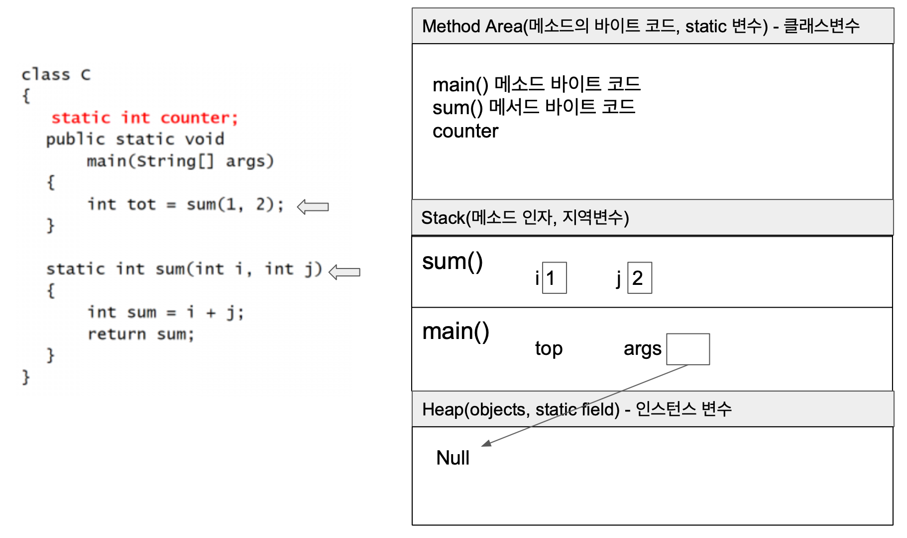

`int sum=i+j;`

sum()메서드에 sum지역변수가 선언되고 i+j==3으로 초기화됩니다.

return을 통해 sum지역변수 값을 내보냅니다.

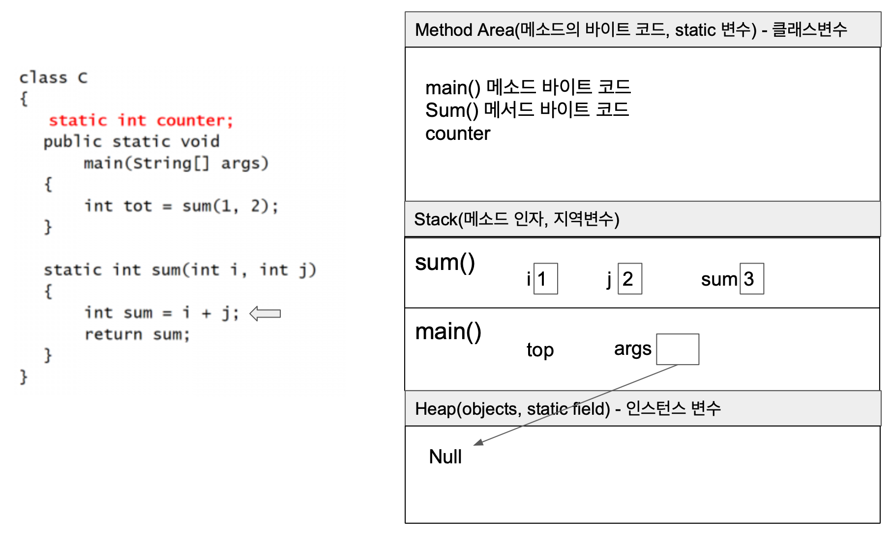

sum()메서드를 다 읽었기 때문에 stack에서 pop됩니다.

메인에서 top에 sum메서드의 return 값이 들어갑니다.

메인 메서드도 다 읽으면 stack pop되고 프로그램이 종료됩니다.

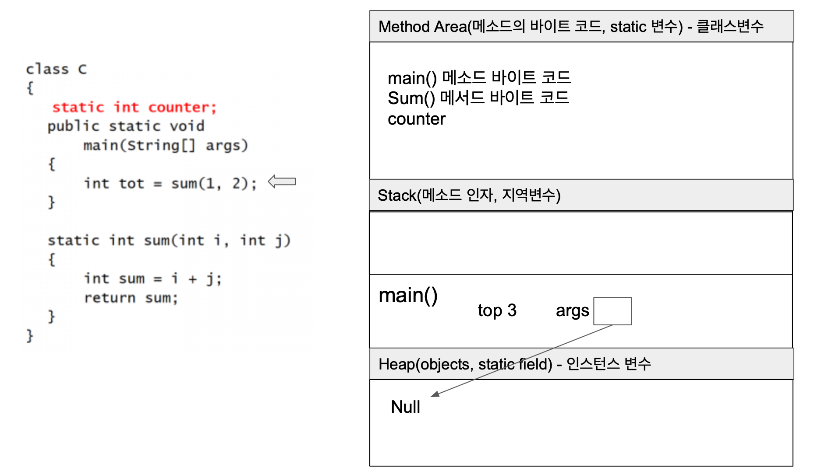

---

---

프로그래밍을 많이 안해보고 이론책으로 들어가면 안좋은게 “아니 개념은 알겠는데 그래서 이걸 언제 어디서 쓴다는거지?” 이런 의문이 계속 듭니다. 그래서 이런 의문을 해소하기 위해 예시를 많이 가져와봤습니다.

## this()

this()는 생성자에서 다른 생성자를 호출합니다.

개발자는 중복을 싫어합니다. 특히 객체 지향 프로그래밍에서요!

자바의 정석을 쭉 읽어보면 아마 중복을 없애기 위해서 이런저런짓(상속, 클래스,메서드…)을 많이 하는데

this()도 이런저런짓 중 하나입니다.

생성자를 여러개 생성했을때 this()의 사용입니다.

### this() 사용 안 할 경우

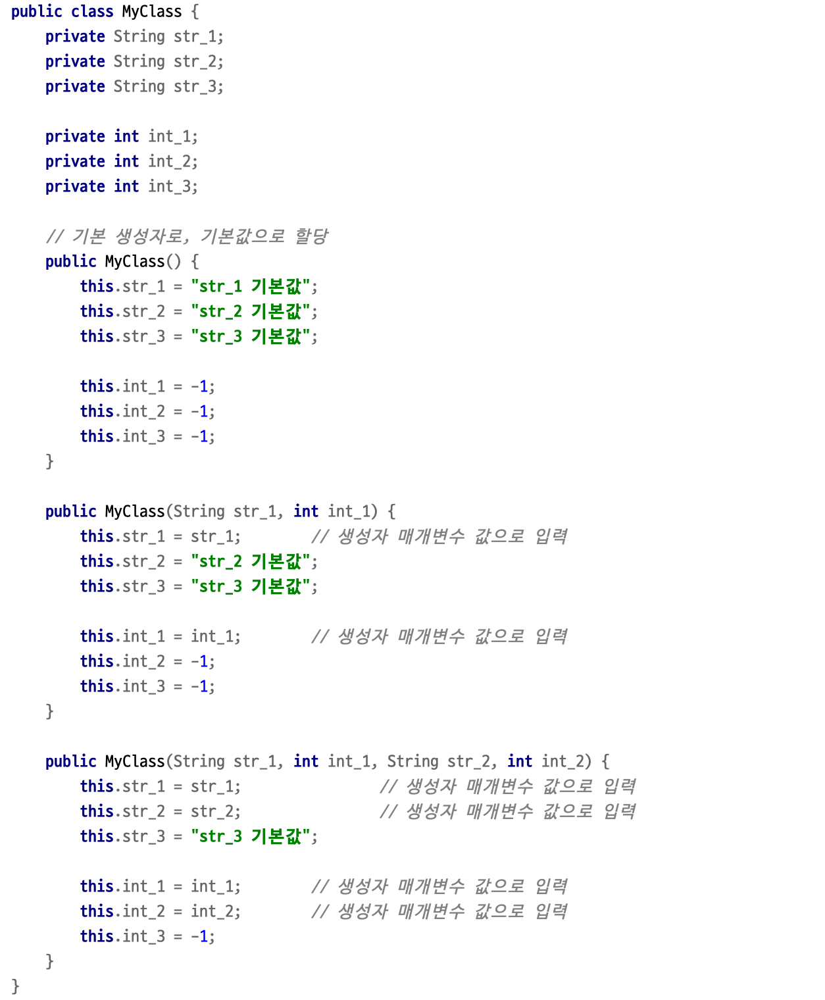

### this() 사용 할 경우

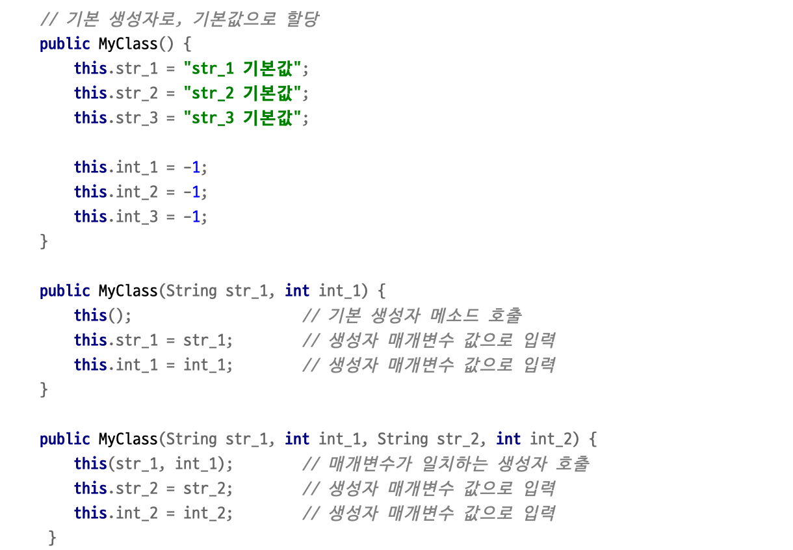

책에서는 생성자와 오버로딩을 따로 설명한다.

보통 오버로딩을 사용할때가 생성자를 생성할때다.

그 예시를 가져와봤습니다.

## 생성자 오버로딩

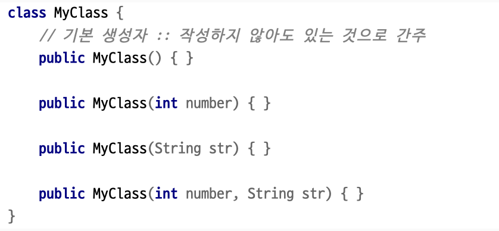

출처

자바의 정석

[https://m.blog.naver.com/leejongcheol2018/222093908691](https://m.blog.naver.com/leejongcheol2018/222093908691)

[https://trek2tech.wordpress.com/java/jvm-internals/](https://trek2tech.wordpress.com/java/jvm-internals/)

 [https://www.youtube.com/watch?v=UzaGOXKVhwU](https://www.youtube.com/watch?v=UzaGOXKVhwU)

[https://xxxelppa.tistory.com/198?category=858435](https://xxxelppa.tistory.com/198?category=858435)