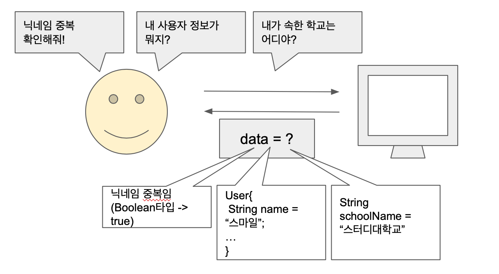

# 지네릭스, 열거형, 에너테이션 - 간단한 예시

# 지네릭스

제네릭스를 처음 공부 했을 때 아니 그래서 이걸 내가 사용할 일이 있을까? 라는 생각이 먼저들었습니다.

그렇기 때문에 간단하게 실제로 제 프로젝트에서 제네릭스가 어떻게 쓰이는지 예시를 가져와봤습니다.



사용자는 컴퓨터한테 바라는게 굉장히 많습니다.

닉네임 중복을 확인, 사용자 정보 조회, 소속한 학교 정보 조회 등 컴퓨터에게 여러 종류의 데이터를 요청합니다.

닉네임 중복을 확인하는 경우 컴퓨터는 boolean타입으로 true(중복됨) 또는 false(중복안됨)을 전달할 것이고 사용자 정보 조회는 User 타입 객체를 전달할 것이고 학교 정보는 String타입을 전달할 것 입니다.

여기서 data안에 들어갈 타입값이 정해진게 없기때문에 함부로 Integer나 Object와 같은 고정된 타입을 확정해서는 안됩니다. → 이럴때 제네릭스를 씁니다!!!

이제 위 예시를 코드를 통해 살펴보겠습니다.

```
@Getter
@Setter
public class Data<T> extends CommonResult {
   private T data;
}
```

```
// 단일건 결과 처리
public <T> SingleResult<T> getSingleResult(T data) {
   SingleResult<T> result = new SingleResult<>();
   result.setData(data);
   setSuccessResult(result);
   return result;
}
```

제네릭스에서 너~무 간단한 예시이지만 제가 프로젝트에서 제릭스를 어떻게 사용하고 있는지 알려드리고 싶어 가져와봤습니다.

# Enum

Enum은 상수의 목록입니다.

상수는 고정된 값으로 final static 키워드를 사용해 만듭니다.

** final은 수정할 수 없음 static은 인스턴스 변수로 만들 필요가 없음(모든 영역 바로 사용)

어떻게 enum이 만들어졌는지 살펴보면

여러개 상수를 선언할때

```java
		// fruit
    private final static int FRUIT_APPLE = 1;
    private final static int FRUIT_PEACH = 2;
    private final static int FRUIT_BANANA = 3;

    // company
    private final static int COMPANY_GOOGLE = 1;
    private final static int COMPANY_APPLE = 2;
    private final static int COMPANY_ORACLE = 3;
```

공통된 카테고리로 묶어 클래스 안에 클래스 객체로 선언할때

```java
class Fruit{
    public static final Fruit APPLE  = new Fruit();
    public static final Fruit PEACH  = new Fruit();
    public static final Fruit BANANA = new Fruit();
}
class Company{
    public static final Company GOOGLE = new Company();
    public static final Company APPLE = new Company();
    public static final Company ORACLE = new COMPANY(Company);
}
```

enum을 사용할때

```java
enum Fruit{
    APPLE, PEACH, BANANA;
}
enum Company{
    GOOGLE, APPLE, ORACLE;
}
```

enum 간단한 예시

```java
@Getter
@AllArgsConstructor
public enum RoleType {
USER("ROLE_USER", "일반 사용자 권한"),
ADMIN("ROLE_ADMIN", "관리자 권한"),
GUEST("GUEST", "게스트 권한");

   private final String code;
   private final String displayName;

   public static RoleType of(String code) {
      return Arrays.stream(RoleType.values())
         .filter(r -> r.getCode().equals(code))
         .findAny()
         .orElse(GUEST);
   }
}
```

사용자의 유형이 로그인 전에는 게스트 or 로그인 후에는 일반 사용자 or 관리자 나눠지는데

이런 상수를 관리하기 위해 enum타입으로 선언했습니다.

# 애너테이션

애너테이션의 사전적 의미가 주석이지만 사실 보통 알고있는 주석과 성격이 다릅니다.

보통 주석은 // /***/을 쓰면서 사람들에게 내 코드를 설명하기 위해 쓰이는 주석이고

에너테이션의 경우에는 사람이 아닌 컴파일러를 위해 작성하는 주석입니다.

그래서 보통 컴파일러에게 문법 오류를 체크할 수 있는 힌트를 준다거나, 빌드시 코드를 자동 생성 한다거나 런타임 시점에 참고해서 특정 동작을 하도록 사용할 수 있습니다.

대표적인 예로 문법 오류를 체크하는 것과 관련해서 @Override

코드 자동 생성에 대해 롬복(lombok) 라이브러리

```java
@Getter
@Setter
public class Data {
   private String name;

//밑 코드를 자동 생성해줌
	public void setName(String name){
		this.name=name;
	}

	public String getName(){
		return name;
	}
}
```

런타임 시점에 특정 동작을 하는것에 대해 스프링의 aop 등이 있습니다.

그냥`@Retention(RetentionPolicy.*RUNTIME*)` 책에서 배웠다시피 이 키워드를 붙이면 런타임 시점에 동작합니다