# 쓰레드 thread

## 프로세스
- 실행 중인 프로그램
- 프로그램을 실행하면 OS로부터 실행에 필요한 자원(메모리)을 할당받아 프로세스가 된다.
    <br>
- 프로그램 수행 시 필요한 자원(데이터,메모리 등)과 쓰레드(최소 하나 이상)로 구성
    - 자원을 이용해서 작업 수행하는 것이 쓰레드!
    
    > ### 싱글쓰레드(single-threaded process) / 멀티쓰레드(multi-threaded process)
    > 
    > - 둘 이상의 쓰레드를 가진 프로세스를 '멀티쓰레드 프로세스' 라고 한다
    > > **❓ 프로세스가 가질 수 있는 쓰레드 개수는 제한이 있을까요?**</br></br>
        제한되어 있지 않습니다! 
        </br>다만, 쓰레드는 작업을 수행하는데 메모리 공간(호출스택)이 필요합니다.
        </br>따라서 프로세스의 메모리 한계에 따른 개수 제한이 있다고 볼 수 있습니다.
        </br></br>(실제로는 프로세스의 메모리 한계에 다를 정도로 많은 쓰레드를 생성하는 일은 없어 걱정하지 않아도 된다고 합니다:)

## 멀티프로세스(멀티태스킹,다중작업) vs 멀티쓰레드(멀티 쓰레딩)
- 멀티태스킹 : 동시에 여러 프로세스를 실행시키는 것
- 멀티쓰레딩 : 하나의 프로세스 내에 동시에 여러 쓰레드를 실행시키는 것
  > 멀티태스킹이 가능함으로써 프로그램을 다운받으면서 웹서핑을 동시에 할 수 있게 된다.

  > **멀티쓰레딩의 장점**
  > - CPU의 사용률을 향상시킨다．
  > - 자원을 보다 효율적으로 사용할 수 있다．
  > - 사용자에 대한 응답성이 향상된다．
  > - 작업이 분리되어 코드가 간결해진다． 
  > 
  > 멀티쓰레딩이 가능함으로써 메신저로 파일을 다운로드하면서 채팅을 할 수 있게 된다.
  > 
  > **멀티쓰레딩의 단점**
  > 
  > - 동기화(synchronization)
  > - 교착상태(deadlock) : 두 쓰레드가 자원을 점유한 상태에서 서로 상대펀이 점유한 자원을 사용하려고 기다리느라 진행이 멈춰있는 상태
  > 
  > 아래에서 싱글쓰레드와 멀티쓰레드의 차이점을 좀 더 자세히 보겠습니다.   
  

## 쓰레드의 구현과 실행
1. Thread클래스를 상속받는 방법
   -  다른 클래스를 상속받을 수 없다.
        ```java
        class MyThread extends Thread {
            public void run() { /* 작업내용 */ } // Thread클래스의 run(）을오버라이딩
        }
        ```
2. Runnable인터페이스를 구현하는 방법 
    - 재사용성(reusability)이 높고 코드의 일관성(consistency)을 유지할 수 있기 때문에 보다 객쳬지향적인 방법
        ```java
        class MyThread implements Runnable {
            public void run() { /* 작업내용 */ } // Runnable인터페이스의 run(）을구현
        } 
        
        ```
        > **Runnable인터페이스** : 오로지 run(）만 정의되어 있는 간단한 인터페이스
        > ```java
        > public interface Runnable {
        >     public abstract void runO;
        > }
        > ```
 
> ### Thread 클래스 상속 vs Runnable 인터페이스 구현
> ```java
> class ThreadExl {
>  public static void main(String args[]) {
>    //인스턴스 생성 방법이 다르다.
>    ThreadEx1_1 t1 = new ThreadEx1_1();
> 
>    Runnable r = new ThreadEx1_2();
>    Thread t2 = new Thread(r); // 생성자 Thread(Runnable target)
>    t1.start(); //start()를 하면 실행대기 상태로 있다가 자신의 차례가 오면 실행 
>    t2.start(); //-> 내부적으로 run() 수행
>    //한 번 실행이 종료된 쓰레드는 다시 실행할 수 없다 
>    // = 하나의 쓰레드에 대해 start(）가 한 번만 호출될 수 있다
>    // 한 번 더 실행하려면 새로 생성해줘야함
>  }
> }
> class ThreadEx1_1 extends Thread {
>   public void run() {
>     for(int i=0; i < 5; i++) {
>       System.out.println (getName()); // 조상인 Thread의 getName()을 직접호출
>     }
>   }
> }
> class ThreadEx1_2 implements Runnable {
>   public void run() {
>     for(int i=0; i < 5; i++) {
>     // Thread. currentThread() - 현재실행중인 Thread를반환한다．
>     System.out.println(Thread.currentThread().getName()); 
>                             //쓰레드에 대한 참조를 얻어 와야 호출가능
>   }
>   }
> }
>```
> 
>- 결과<br>
>  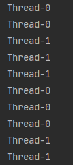 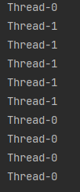 
> 
> 
> - 참고)  에 있는 소스코드<br>
>    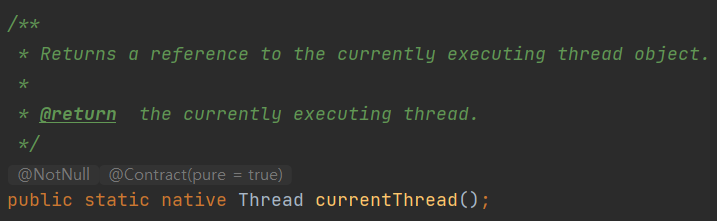<br>
>    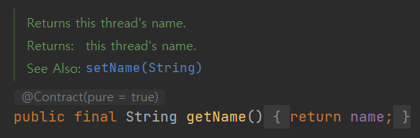<br>
>   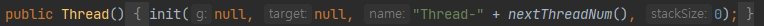<br>
>   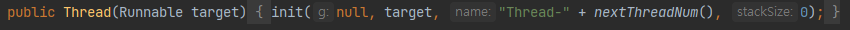<br>
>   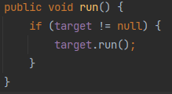 target : private Runnable target;<br>
>   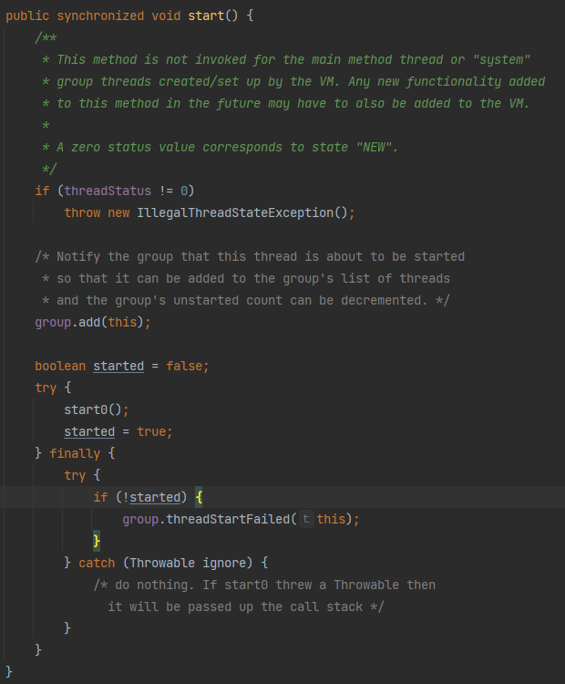


## run() vs start()
- run() : 단순 클래스의 선언된 메서드를 호출(생성된 쓰레드를 실행시키는 것이 아님)
- start() : 쓰레드 실행
    - 새로운 쓰레드가 작업을 실행하는데 필요한 **호출스택（call stack）을 생성**한 다음 
      run(）을 호출해서, 생성된 호출스택에 run(）이 첫 번째로 올라가게 한다.
      (쓰레드는 독립적인 작업을 수행하기 위해 자신만의 호출스택을 필요)
      <br>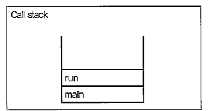
    - 새로운 쓰레드를 생성하고 실행시킬 때마다 <br>새로운 호출스택이 생성되고 <br>쓰레드가 종료되면 작업에 사용된 호출스택은 소멸
    <br>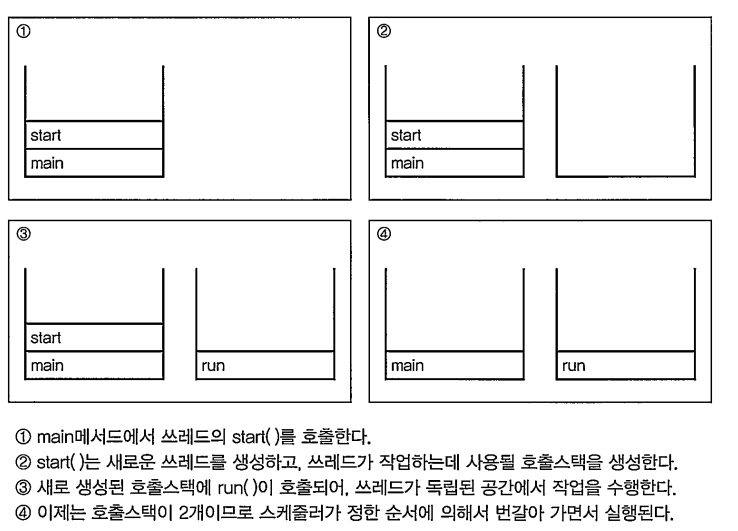
      > main메서드의 작업을 수행하는 것도 쓰레드
    
> 실행 중인 사용자 쓰레드가 하나도 없을 때 프로그램은 종료된다．  

## 싱글쓰레드 vs 멀티쓰레드
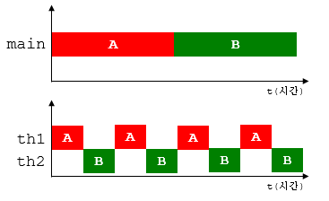</br>
1. 한 작업 마친 후 다른 작업 
2. 짧은 시간동안 두 개의 쓰레드가 번갈아 가면서 작업
> 두 경우 최종 수행 시간은 거의 같지만 쓰레드간의 작업 전환(context switching)에 시간이 걸려 두 개의 쓰레드로 작업한 시간이 더 오래 걸린다고한다.
> 
> > 작업을 전환할 때는 작업의 상태(다음에 실행할 위치 등)정보를 저장하고 읽는 시간이 소요된다고 합니다.

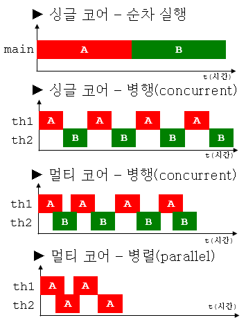</br>
- 싱글 코어 일 경우, 두 작업이 겹치지 않음
- 멀티 코어 일 경우, 동시에 두 쓰레드가 수행될 수 있으므로 작업이 겹칠 수 있음
> 병행（concurrent) : 여러 쓰레드가 여러 작업을 동시에 진행</br>
> 병렬（parallel） : 하나의 작업을 여러 쓰레드가 나눠 처리

## 쓰레드의 우선순위
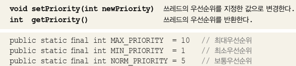<br>
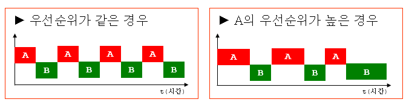
- 작업의 중요도에 따라 쓰레드의 우선순위 다르게 지정하여 특정 쓰레드가 더 많은 작업시간을 갖도록 할 수 있다.
- 가질 수 있는 우선순위의 범위는 1-10
-  숫자가 높을수록 우선순위가 높음
- 쓰레드의 우선순위는 쓰레드를 생성한 쓰레드로부터 상속받는다.
    </br>(main메서드를 수행하는 쓰레드는 우선순위가 5이므로 main메서드 내에서 생성하는 쓰레드의 우선순위는 자동적으로 5)
  
## 쓰레드 그룹(thread group)
: 서로 **관련된 쓰레드**를 그룹으로 다루기 위한 것
- 보안상의 이유로 도입
- 모든 쓰레드는 반드시 하나의 쓰레드 그룹에 포함
    - 쓰레드 그룹을 지정하지 않고 생한한 쓰레드는 main쓰레드 그룹에 속함
      > ### 자바 어플리케이션이 실행되면
      > 1. 실행
      > 2. JVM이 `main`과 `system`이라는 쓰레드 그룹을 만듦
      > 3. JVM운영에 필요한 쓰레드들을 생성
      > 4. 각자 해당하는 쓰레드 그룹에 포함시킴
      > - ex) main쓰레드 - main쓰레드 그룹 / (가비지컬렉션을 수행하는)Finalizer쓰레드 - system쓰레드 그룹
    - 자신을 생성한 쓰레드의 그룹과 우선순위를 상속 받음.
- 자신이 속한 쓰레드 그룹 or 하위 쓰레드 그룹은 변경가능하지만 다른 쓰레드 그룹의 쓰레드는 변경 불가
- ThreadGroup의 생성자와 메서드</br>
    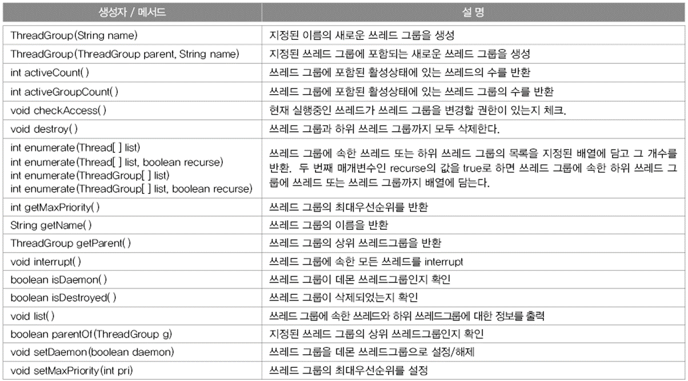
- Thread 생성자를 이용해 쓰레드 그룹에 포함 시킬 수 있다.<br>
    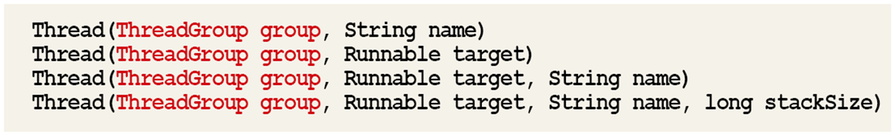
  
## 데몬 쓰레드(daemon thread)
: 다른 일반 쓰레드(데몬 쓰레드가 아닌 쓰레드）의 작업을 돕는 보조적 인 역할을 수행하는쓰레드
- 일반 쓰레드가 모두 종료되면 자동 종료
- 무한루프와 조건문을 이용해 실행 후 대기하다 특정 조건시 수행하고 다시 대기하도록 작성
- ex) 가비지 컬렉터, 자동저장, 화면자동갱신

## 쓰레드의 실행제어
- 쓰레드의 스케줄링과 관련된 메서드<br>
    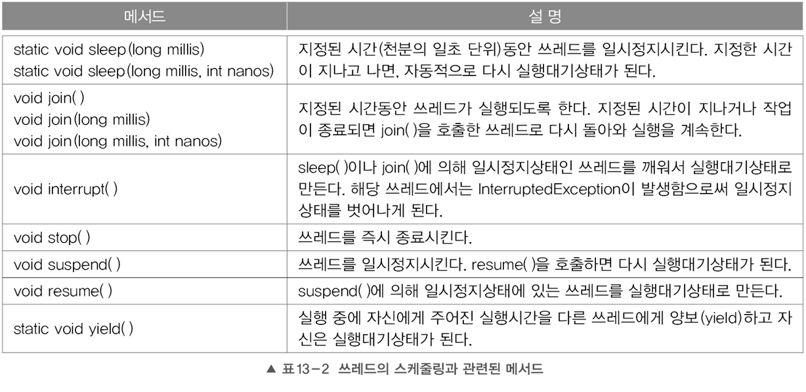
    - resumeQ, stop(), suspend(）는 쓰레드를 교착상태（dead-Icc卞）로 만들기 쉽기 때문에 deprecated
- 쓰레드의 상태<br>
    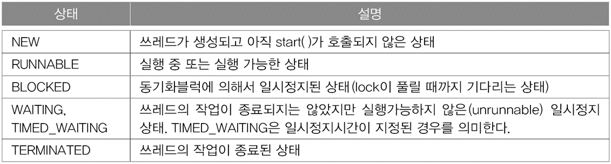

- 쓰레드 생성부터 소멸까지의 상태변화<br>
    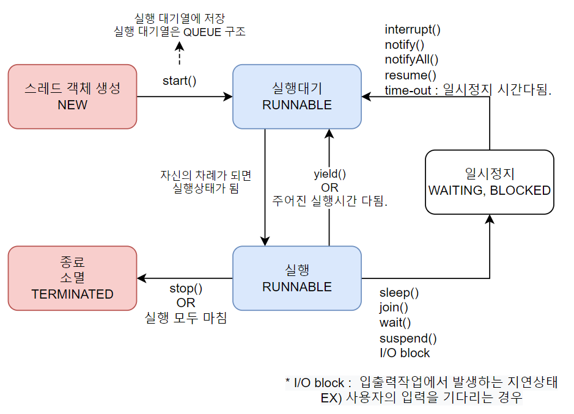
    
### `sleep(long millis)` - 일정시간동안 실행하는 쓰레드 멈춤
```java
static void sleep(long millis)
static void sleep(long millis, mnt nanos)
//밀리세컨드（millis, 1000분의 일초）와 나노세컨드（nanos, 10억분의 일초) 단위로 지정
```
- static으로 선언되어 있어 Thread.sleep(2000) 같이 선언해주는 것이 맞음
    - 특정 쓰레드를 지정해서 멈추게 하는 것은 불가능
- 호출할 때는 항상 try-catch문으로 예외를 처리해줘야 함

### `interrupt()` / `interrupted()` - 쓰레드 작업 취소
- 스레드가 일시 정지 상태일 때 InterruptedException 예외를 발생시키는 역할
- 진행 중인 쓰레드의 작업이 끝나기 전에 취소시켜야할 때 사용
    - ex) 큰 파일 다운로드 할 때 너무 오래 걸려 다운로드를 포기하고 취소
- 스레드가 일시 정지 상태가 되지 않는다면 interrupt() 메소드 호출은 아무런 의미가 없다.
    - 스레드가 실행 대기 또는 실행 상태에 있을 때 interrupt() 메소드가 실행되면 즉시 InterruptedException 예외가 발생하지 않고, 스레드가 미래에 일시 정지 상태가 되면 즉시 InterruptedException 예외가 발생
      참고 : https://ict-nroo.tistory.com/22
```java
void interrupt() // 쓰레드의 interrupted상태를 false에서 true로 변경．
boolean isInterrupted()// 쓰레드의 interrupted상태를반환．
static boolean interrupted() //현재쓰레드의 interrupted상태를반환후, false로 변경 
```
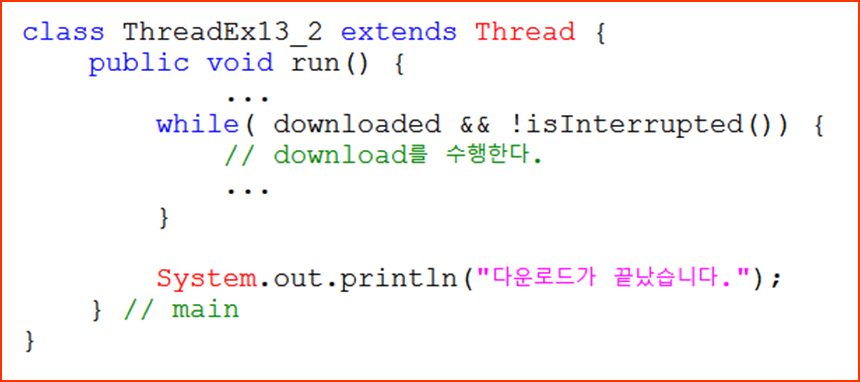
- sleep()에 의해 쓰레드가 잠시 멈춰있을 때, interrupt()를 호출하면 InterruptedException 발생 (interrupted상태는 false로 자동 초기화)
    ```java
    try{
        Tread.sleep(1000);
    } catch(InterruptedException e){
        intrrupt(); // 추가해줘서 true로 바꾸기
    }
    ```
### suspend(), resume(), stop()
```java
void suspend() // 일시정지
void resume() // suspend()에 의해 일시정지된 쓰레드를 실행대기상태로
void stop() // 즉시 종료
```
- 교착상태（deadlock）를 일으키기 쉽게 작성
- deprecated 됨

### `yield()` - 다른 쓰레드에게 양보
- 남은 시간을 다음 쓰레드에게 양보하고 자신은 실행대기한다.
- yield()와 interrupt()를 적절히 사용시, 응답성과 효율을 높임.
    ```java
    while(!stopped){ //stop이 아닌상태에 실행
        if(!supended){ 
            //일시정치 아닌 상태
        }else{
            //일시정지인 상태 → while을 의미 없이 돌아 낭비!!!((busy-waiting)바쁜 대기상태라고함)
            Thread.yield(); // 다른쓰레드에게 양보 → 더 효율적
        }   
        
    }
    ```
```java
public void suspend(){
    suspended = true;
    th.interrupt(); // sleep()에서  InterruptedException이 발생하여 
                // 즉시 일시정지 상태에서 벗어나게 되므로 응답성이 좋아짐.
}
```
### `join()` - 다른 쓰레드의 작업을 기다린다．
- 쓰레드 자신이 하던 작업을 잠시 멈추고 다른 쓰레드가 지정된 시간동안 작업을 수행하도록 기다림
    - `th1.join()` // 현재 실행하고 있는 쓰레드가 th1의 작업이 끝날때 까지 기다림
```java
void join() // 작업이 모두 끝날 때까지(시간을 지정하지 않으면 , 해당 쓰레드가 작업을 모두 마칠 때까지 기다림)
void join(long millis) // 천분의 일초 동안
void join(long millis, mnt nanos) // 천분의 일초 + 나노초 동안
```
- 작업 중 다른 쓰레드의 작업이 먼저 수행되어야할 필요가 있을 때 사용
- interrupt()에 의해 대기상태에서 벗어날 수 있어, try- catch문으로 감싸야 함
- join은 특정 쓰레드 기준 / sleep()은 현재 쓰레드(static 메서드) 기준
- main쓰레드가 th1 th2 작업이 마칠때 까지 기다림
  <br>(join()이 없으면 main쓰레드가 원래는 바로 종료)
    <br>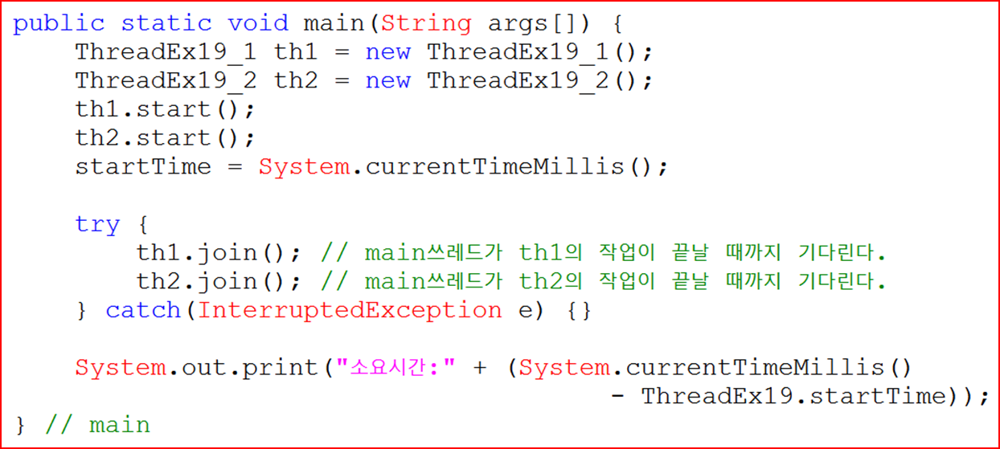

## 쓰레드의 동기화(synchronization)
: 한 쓰레드가 진행 중인 작업을 다른 쓰레드가 간섭하지 못하도록 막는 것
- 한 번에 하나의 쓰레드만 객체에 접근할 수 있도록 객체에 락(lock)걸어서 데이터 일관성 유지하는 것
    > 1. 멀티쓰레드 프로세스는 여러 스레드가 자원 공유하며 작업
    > 2. 서로 영향 줌
    > 3. 의도와는 다른 결과 발생할 수 있음.
    > 4. 이를 방지하기 위해 한 스레드가 특정 작업을 마치기 전까지 방해받지 못하게 해야함
    > 5. 그래서 도입된 개념이 임계 영역(critical section)과 락(lock)!
    >   > 1. 공유 데이터를 사용하는 코드 영역을 임계 영역으로 지정 
    >   > 2. 공유 데이터（객쳬)가 가지고 있는 lock을 획득한 단 하나의 쓰레드만 이 영역 내의 코드를 수행할 수 있게 한다
    >   > 3. 해당 쓰레드가 코드를 수행하고 벗어나서 lock을 반납
    >   > 4. 다른 쓰레드가 반납된 lock을 획득하여 임계 영역의 코드를 수행

### synchronized - 임계영역 설정
- lock의 획득과 반납이 모두 자동적으로 이루어지므로 우리는 임계 영역만 설정해주면 됨
    ```java
    public synchronized void calcSum(){} //메서드를 임계영역으로 지정
    synchronized(객체의 참조변수){} // 특정 객체를 임계영역으로 지정
    ```
- if문의 조건식을 통과하고 출금하기 바로 직전에 다른 쓰레드가 끼어들어서 출금    
    <br>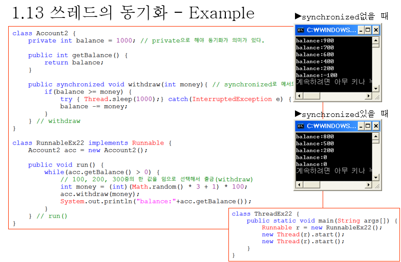
    
### wait() notify()
- 특정 쓰레드가 객쳬의 락을 가진 상태로 오랜 시간을 보내지 않도록 하는 것도 중요
```java
//Object클래스에 정의되있음
//동기화 블록 내에서만 사용가능

//(실행 → 일서정지)
void wait() //객체의 lock을 풀고 쓰레드를 해당 객체의 waiting pool에 넣음
void wait(long timeout)
void wait(long timeout, int nanos)

//(일시정지 → 실행대기)
void notify() //waiting pool 에서 대기중인 쓰레드중 하나를 깨움
void notifyAll() //waiting pool 에서 대기중인 모든 쓰레드를 깨움
```

### Lock과 Condition을 이용한 동기화 (9.3)
- ' java.util.concurrent.locks' 패키지가 제공하는 lock클래스 이용
- synchronized는 같은 메서드 내에서만 lock을 걸 수 있다는 제약이 불편 이럴때 lock클래스 사용
```java
//클래스
ReentrantLock // 재진입이 가능한 lock . 가장 일반적인 배타 lock
ReentrantReadWriteLock // 읽기에는 공유적이고 , 쓰기에는 배타적인 lock
StampedLock // ReentrantReadWriteLock에 낙관적인 lock의 가능을 추가 
```
- ReentrantLock 클래스를 사용하면 시작점과 끝점을 명백히 명시
    ```java
    import java.util.concurrent.locks.ReentrantLock;
    
    class SomeClass {
        private final ReentrantLock locker = new ReentrantLock();
        public void SomeMethod () {
            locker.lock();  // 쓰레드에 락을 겁니다.(동기화의 시작)
            try {
                동기화내용들...
            } catch (어떤예외들) {
                해당예외처리...
            } finally {
                locker.unlock();    // 쓰레드의 락을 풉니다.(동기화 끝지점)
            }
        }
    }
    ```

- ReentrantLock 사용시 wait, notify, notifyAll 사용불가
    - 대신 Condition을 이용<br>
        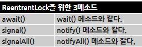
        ```java
        import java.util.concurrent.locks.ReentrantLock;
        import java.util.concurrent.locks.Condition;
        
        class SomeClass {
            private final ReentrantLock locker = new ReentrantLock();
            private final Condition lockerCondition = locker.newCondition();
            public void SomeMethod () {
                locker.lock();  // 쓰레드에 락을 겁니다.(동기화의 시작)
                try {
                    동기화내용들...
                    lockerCondition.await();        //기존의 동기화에서 wait();
                    lockerCondition.signal();       //기존의 동기화에서 notify();
                    lockerCondition.signalAll();    //기존의 동기화에서 notifyAll();
                } catch (어떤예외들) {
                    해당예외처리...
                } finally {
                    locker.unlock();    // 쓰레드의 락을 풉니다.(동기화 끝지점)
                }
            }
        }
        ```
출처: https://eskeptor.tistory.com/83

### volatile
> **멀티 코어 프로세서에서의 변수 값 불일치 문제**<br>
>   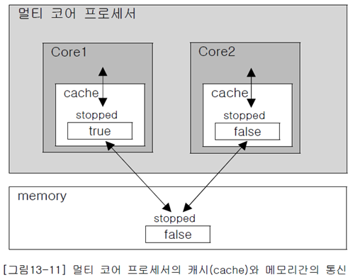
>    1. 멀티 코어 프로세서에서는 코어마다 별도의 캐시를 가짐
>    2. 코어는 메모리에서 읽어온 값을 캐시에 저장
>    3. 캐시에서 값을 읽어서 작업
>    4. 다시 같은 값을 읽어올 때는 먼저 캐시에 있는지 확인 후 없을 때만 메모리에서 읽음
>    5. 도중에 메모리에 저장된 변수의 값이 변경되었는데도 캐시에 저장된 값이 갱신되지 않아서 메모리에 저장된 값이 다른 경우가 발생!
    
- 변수 앞에 volatile을 붙여 캐시와 메모리간의 불일치 해결
    ```java
    volatile boolean suspended = false;
    volatile boolean stopped = false;
    ```
  - volatile을 붙이면 **변수의 값**을 읽어올 때 캐시가 아닌 **메모리에서 읽어**온다.
    > volatile을 붙이는 대신 **synchronized블럭**을 사용해도 같은 효과 얻음
    >
    > (쓰레드가 해당 블럭으로 들어갈 때와 나올 때 , 캐시와 메모리간의 동기화가 이루어지기 때문)
    > ```java
    > public synchronized void stop() {
    >   stopped = true;
    > }
    > ```

### fork & join 프레임웍 
> 10넌 전까진 CPU의 속도는 매년 거의 2배씩 빨라짐
> 
> 속도 향상에는 한계에 도달해 코어 개수를 늘려 CPU 성능 향상
> 
> 멀티 코어를 잘 활용할 수 있는 멀티쓰레드 프로그래밍이 점점 더 중요!

- JDK1.7부터 ' fork & join 프레임웍 ' 이 추가
    - 하나의 작업을 작은 단위로 나눠서 여러 쓰레드가 동시에 처리하는 것을 쉽게 만들어 준다
- 수행할 작업에 따라 두 클래스 중에서 하나를 상속받아 구현
    ```java
    public abstract class RecursiveAction extends ForkJoinTask<T> 
    //RecursiveAction : 반환값이 없는 작업을 구헌할 때 사용
  
    public abstract class RecursiveTask extends ForkJoinTask<T>
    //RecursiveTask : 반환값이 있는착업을구현할 때 사용
    ```
  - 두 클래스 모두 `compute()`라는 추상 메서드를 가지고 있어 상속으로 구현하면 됨.
- 시작은 fork&join프레임웍에서 제공하는 thread poll인 ForkJoinPool을 이용해 
  <br>invoke()로 시작(쓰레드의 start()랑 비슷한 느낌)
    ```java
    ForkJoinPool pool = new ForkJoinPool(); // 쓰레드 풀을 생성 
    SumTask task = new SumTask(from, to); // 수행할 작업을 생성  
    // SumTask는 RecursiveTask를 구현한 클래스
    
    Long result = pool.invoke(task); // invoke()호출해서 작업 시작
    ```
    - 장점
        - 쓰레드를 생성해서 미리 만들어 놓고 반복해서 재사용 → 쓰레드를 반복해서 생성하지 않아도 된다 
        - 많은 쓰레드가 생성되어 성능이 저하되는 것을 막아준다
- 쓰레드 풀은 쓰레드가 수행해야하는 작업이 담긴 큐를 제공하며 , 각 쓰레드는 자신의 작업 큐에 담긴 작업을 순서대로 처리
  <br>(참고 : 쓰레드 풀은 기본적으로 코어의 개수와 동일한 개수의 쓰레드를 생성한다．)

- `compute()` 구현
    - `compute()`를 구현할 때는 수행할 작업과 작업을 어떻게 나눌 것인지를 정해야한다.
    - 수행할 작업의 범위를 반으로 나눠서 새로운 작업을 생성해서 실행시키기... 말이 어렵네요 코드를 봅시다..
        ```java
        public Long compute() { 
            long size = to - from + 1; 
            if (size <= 5) // 더할숫자가 5개 이하면 
                return sum(); // 숫자의 합을 반환． //sum()은 from부터 to까지의 수를 더해서 반환 
        
            // 범위를 반으로 나눠서 두 개의 작업을 생성 
            long half = (from+to) /2; 
            
            SurnTask leftSum = new SumTask(from, half); 
            SumTask rightSum = new SumTask (half+1, to); 
            
            leftSum.fork(); // 작업 (leftSum）을작업 큐에 넣는다． 
                
            return rightSurm. compute() + leftSum. join();  //재귀! // 동기 메서드． 호출결과를기다린다
        }
        ```
        -  목적은 더하기! 입니다. 근데 더하는 작업을 반으로 나누고 나누면서 작업을 fork(큐에 넣는)하는거죠!
           <br>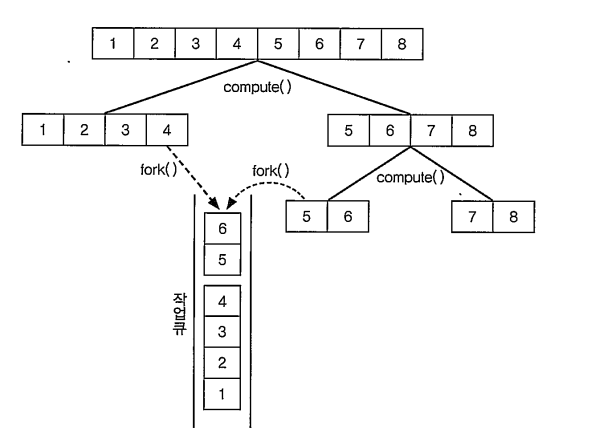
           - 그림에서는 size가 2가 될 때까지 나눕니다.
        - 이렇게 fork()가 호출되어 작업 큐에 추가된 작업도 compute()에 의해 나누는 것 을 반복한다고 합니다.
            - 작업 큐가 비어있는 쓰레드가 다른 쓰레드의 작업을 가져와서 수행하죠 이것을 훔쳐오기(work stealing)라고 하는데 
                <br>쓰레드풀에 의해 자동적으로 작동한다고 해요! 
                <br>이런 과정을 통해 한 쓰레드에 작업이 몰리지 않고 골고루 작업을 나누어 처리한다고 합니다.
        - `fork()`와 `join()`
            ```java
            fork() //해당 작업을 쓰레드 풀의 작업 큐에 넣는다. 비동기 메서드 
            join() //해당 작업(재귀호출된 compute()가 모두 종료될때까지)의 수행이 끝날 때까지 기다렸다 수행이 끝나면 그 결과를 반환한다．동기 메서드
            ```