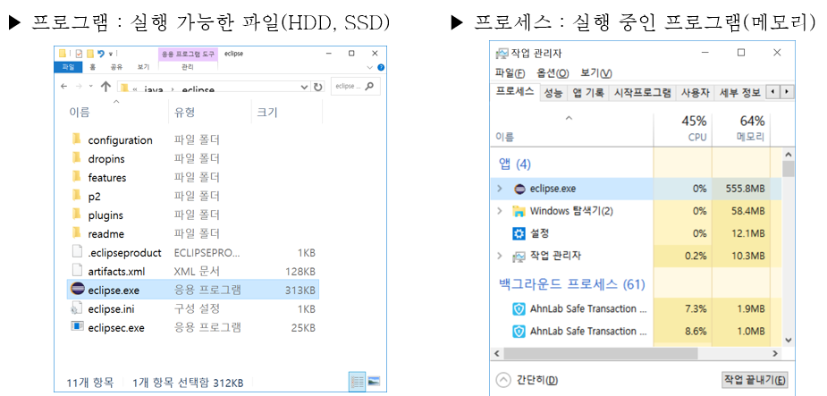

#쓰레드 thread

##프로세스
- 실행 중인 프로그램
- 프로그램을 실행하면 OS로부터 실행에 필요한 자원(메모리)을 할당받아 프로세스가 된다.
    
- 프로그램 수행 시 필요한 자원(데이터,메모리 등)과 쓰레드(최소 하나 이상)로 구성
    - 자원을 이용해서 작업 수행하는 것이 쓰레드!
    
    > ### 싱글쓰레드(single-threaded process) / 멀티쓰레드(multi-threaded process)
    > 
    > - 둘 이상의 쓰레드를 가진 프로세스를 '멀티쓰레드 프로세스' 라고 한다
    > > **❓ 프로세스가 가질 수 있는 쓰레드 개수는 제한이 있을까요?**  
        제한되어 있지 않습니다! 
         다만, 쓰레드는 작업을 수행하는데 메모리 공간(호출스택)이 필요합니다.
         따라서 프로세스의 메모리 한계에 따른 개수 제한이 있다고 볼 수 있습니다.
          (실제로는 프로세스의 메모리 한계에 다를 정도로 많은 쓰레드를 생성하는 일은 없어 걱정하지 않아도 된다고 합니다:)

##멀티프로세스(멀티태스킹,다중작업) vs 멀티쓰레드(멀티 쓰레딩)
- 멀티태스킹 : 동시에 여러 프로세스를 실행시키는 것
- 멀티쓰레딩 : 하나의 프로세스 내에 동시에 여러 쓰레드를 실행시키는 것
    > 멀티태스킹이 가능함으로써 프로그램을 다운받으면서 웹서핑을 동시에 할 수 있게 된다.

> 여러 프로세스를 함께 돌리는 작업 -> 동시적(Concurrency),병렬적(Parallelism)
> 