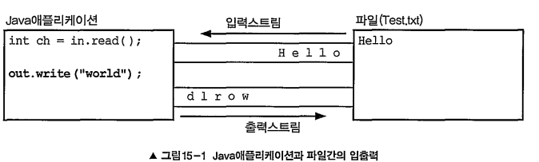

# IO~430

# 스트림(stream)

: 데이터를 운반하는데 사용되는 연결통로
: 데이터를 전달할 때 두 대상을 연결하고 데이터를 전송할 수 있는 것

- 자바에서 모든 입출력은 스트림(stream)을 통해 이루어진다.
- **단방향 통신**만 가능 → 하나의 스트림으로 입력 출력 동시에 처리 불가
- 먼저 보낸 데이터를 먼저 받으며 연속적으로 데이터를 주고받음.
(First In First Out구조로 되있다고 생각하면됨.)
- 바이트단위로 데이터 전송



14장의 스트림과는 다른개념

# 바이트기반 스트림

- 바이트 기반 : 입출력 단위가 1byte라는 뜻

## InputStream, OutputStream

- 입출력 대상에 따른 입출력스트림
    
    
    
    - 어떠한 대상을 작업할 것 인지, 입력/출력 무엇을 할 것인지 선택해서 사용
    - 이들 모두 InputStream 또는 OutputStream의 자손
    - 입출력을 처리할 수 있는 표준화된 방법을 제공함으로쩌 입출력의 대상이 달라져도 동일한 방법으로 입출력이 가능하기 때문에 프로그래밍을 하기에 펀리
        
        
        
        - read()와 write(int b)는 추상메서드 
        : 입출력의 대상에 따라 읽고 쓰는 방법이 다를 것이기 때문에 각 상황에 알맞게 구현하라는 의미
        - 추상메서드가 아닌 read와 write는 추상메서드인 read()dhk write(int b)를 사용한다.
            
            ```java
            public abstract class InputStream { 
            	// 입력스트림으로부터 1 byte를읽어서 반환한다． 읽을수없으면 -1을반환한다． 
            	abstract int read(); 
            
            	// 입력스트림으로부터 len개의 byte를 읽어서 byte배열 b의 off위치부터 저장한다． 
            	int read(byte[] b, m1t off, mnt len) { 
            		for (mnt i= off; I < off + len; i++) { 
            			// read(）를호출해서 데이터를 읽어서 배열을채운다． 
            			b[i] = (byte)read(); 
            		} 
            	}
            
            	// 입력스트림으로부터 byte배열 b의 크기만큼 데이터를 읽어서 배열 b에 처장한다． 
            	int read(byte[] b) { 
            			return read(b, 0, b.length); 
            	}
            }
            
            // read(）없이는 
            // read(byte[] b, i끄t off, tnt len）와 read(byte[그 b）는 의미가 없다!!
            ```
            
- 메서드
    - InputStrema 메서드
        
        
        
    - OutputStream 메서드
        
        
        
    
    > 프로그램이 종료될 때 , 
    사용하고 닫지 않은 스트림을 JVM이 자동적으로 닫아 주기는 하지만 , **스트림을 사용해서 모든 작업을 마치고 난 후에는 close(）를 호출해서 반드시 닫아 주어야 한다 .** 
    그러나 ByteArraylnputStream과 같이 메모리를 사용하는 스트림과 System.in, System.out과 같은 표준 입출력 스트림은 닫아 주지 않아도 된다.
    > 

## ByteArrayInputStream과 ByteArrayOutputStream

: 메모리 , 즉 바이트 배열에 데이터를 입출력 하는데 사용되는 스트림

- 주로 다른 곳에 입출력하기 전에 **데이터를 임시로 바이트배열에 담아서 변환 등의 작업**을 하는데 사용
- 자주 사용은 안된다고 하나 입출력 예제로 보여주기가 괜찮다고 합니다.
    - ex. inSrc를 outSrc로 복사
        
        read()와 write()를 사용하는 가장 기본적인 방법
        
        ```java
        import java.io.*; 
        import java.util .Arrays; 
        class IOEx1 { 
        	public static void main(String[] args) { 
        		byte[] inSrc= {0,1, 2,3,4,5,6,7,8, 9} ; 
        		byte[] outSrc = null; 
        
        		ByteArrayInputStream input = null; 
        		ByteArrayOutputStream output = null;
        		input = new ByteArraylnputStream(inSrc); 
        		output = new ByteArrayOutputStream (); 
        
        		int data = 0; 
        
        		while( (data = input.read() !=-l) { 
        			output.write(data); // void write(int b) 
        		} 
        		outSrc = output.toByteArray(); // 스트림의 내용을 byte배열로반환한다． 
        	
        		System.out.println("Input Source : " + Arrays .toString(mnSrc)); 
        		System.out.prmntln("Output Source : " + Arrays .toString(outSrc); 
        	} 
        }
        =============================================
        실행결과 
        Input Source : [0, 1, 2, 3, 4, 5, 6, 7, 8, 9] 
        Output Source : [0, 1, 2, 3, 4, 5, 6, 7, 8, 9]
        ```
        
        - 해당 예제는 1byte씩만 읽고 써서 비효율적
            
            ```java
            input.read(ternp, 0, temp.length); // 읽어 온 데이터를 배열 temp에 담는다． 
            output.write(temp,5, 5); // temp[5〕부터 5개의 데이터를 write한다．
            ```
            
            위 처럼 hit read(byte[] b, int off, int len）와void write(byte[] b, int off, int len)를 사용하면 byte배열을 한번에 배열의 크기만큼 읽고 쓰기 가능 
            
            → 배열을 이용한 입출력은 효율 증가시켜줌
            

## FileInputStream과 FileOutputStream

파일에 입출력을 하기 위한 스트림

- 생성자
    
    
    

# 문자기반 스트림

- 자바에서는 char가 2byte이기 때문에 바이트기반의 스트림으로 2byte인 문자를 처리하는데 어려움이 있어 이를 보완하기 위해 문자기반 스트림이 제공됨.
    
    ( ⇒ 문자데이터 입출력은 문자기반 스트림을 사용하자!!)
    

> **바이트기반 VS 문자기반**
> 
> - 바이트기반 스트림과 문자기반 스트림 비교
>     
>     
>     
>     - InputStream → Reader
>     - OutputStream → Writer
> 
> > StringBufferlnputStream,, StringBufferOutputStream은 
> StringReader와 String Writer로 대체되어 사용 x
> > 
> 
> - read write메서드 비교
>     
>     
>     
> - 보조스트림 비교
>     
>     
>     

## Reader , Writer

문자기반 스트림의 조상 

- 메서드
    
    byte배열 대신 char배열을 사용한다는 것 외에는 
    InputStream/OutputStream의 메서드와 다르지 않다．
    
    - Reader 메서드
        
        
        
    - Writer 메서드
        
        
        

## FiIeReader와 FileWriter

파일로부터 텍스트데이터를 읽고 , 파일에 쓰는데 사용

## PipedReader와 PipedWriter

프로세스(쓰레드)간의 통신(데이터 주고받음)에 사용

- 출력스트림을 하나의 스트림으로 연결해서 데이터를 주고 받는다는 특징이 있다.
    - 스트림 생성 후 어느 한쪽 쓰레드에서 connect()를 호춣서 입력스트림과 출력스트림을 연결
        
        입출력을 마친 후에는 어느 한쪽 스트림만 닫아도 나머지는 자동 닫힘.
        

## StringReader와 StringWriter

- CharArrayReader/CharArrayWriter와 같이 메모리 입출력에 사용하는 스트림

```java
StringBuffer getBuffer() //StringWriter에 출력한 데이터가 저장된 StringBuffer를 반환한다
String toString() //StringWriter에 출력된 (StringBuffer에 저장된) 문자열을 반환한다
```

# 보조 스트림

: 스트림의 기능을 보완하기 위한 보조스트림

- 스트림의 기능을 향상시키거나 새로운 기능을 추가할 수 있다
    - 실제 데이터는 주고받지 않음 → 데이터 입출력 기능이 없다.
- 스트림을 먼저 생성 후 스트림을 이용해 보조스트림 생성
    - ex. test. txt라는 파일을 읽기
        
        ```jsx
        // 먼저 기반스트림을생성한다． 
        FileInputStrearn fis = new FileInputStream('Ttest.txt') ; 
        // 기반스트림을 이용해서 보조스트림을 생성한다．
        BufferedlnputStrearn bis = new BufferedInputStream(fis); 
        bis.read(); // 보조스트림인 BufferedInputStream으로부터 데이터를읽는다．
        ```
        
        - FilelnputStream(기반스트림)을 사용
        - 입력 성능 향상을 위해 버퍼를 사용하는 보조스트림인 BufferedllnputStream을 사용
            
            실제 입력기능은 (BufferedlnputStream과 연결된) FilelnputStream이 수행
            
            BufferedlnputStream은 버퍼만을 제공
            
            (버퍼를 사용한 입출력과 사용하지 않은 입출력간 성능차이가 상당하기 때문에 대부분의 경우에 버퍼를 이용한 보조스트림을 사용)
            
- 보조스트림 종류
    
    
    
    BufferedlnputStream, DatalnputStream, DigestlnputStreain, LineNuniberInputStream, PushbacklnputStream 
    
    모두 FilterlnputStream의 자손 → 모든 보조스트림 역시 InputStream과 OutputStream의 자손들이므로 입출력방법이 같다.
    

## 바이트기반의 보조 스트림

### FilterlnputStream과 FilterOutputStream

- InputStream/OutputStream의 자손이면서 모든 보조스트림의 조상
- 보조스트림은 자쳬적으로 입출력을 수행할 수 없기 때문에 기반스트림을 필요로 함
    
    ```jsx
    protected FilterInputStream (InputStream in) 
    // protected 
    // -> Filter InputStream의 인스턴스를 생성해서 사용할 수 없고 상속을 통해서 오버라이딩되 
    어야 한다
    public FilterOutputStream (OutputStream out)
    ```
    
- FilterlnputStream/FilterOutputStream의 모든 메서드는 
단순히 기반스트림의 메서드를 그대로 호출할 뿐
- 상속을 통해 원하는 작업을 수행하도록 읽고 쓰는 메서드를 오버라이딩해야 함.

### BufferedInputStream과 BufferedOutputStream

스트림의 입출력 효율을 높이기 위해 버퍼를 사용하는 보조스트림

- 한 바이트씩 입출력하는 것 보다는 버퍼(바이트배열)를 이용해서 
**한 번에 여러 바이트**를 입출력하는 것이 빠르기 때문에 대부분의 입출력 작업에 사용
- BufferedInputStream 생성자
    
    
    
    - BufferedlnputStream의 버퍼크기는 입력소스로부터 한 번에 가져올 수 있는 데이터의 크기로 지정하면 좋다
        - 보통 입력소스가 파일인 경우 4096 정도의 크기로 하는 것이 보통
        - 버퍼의 크기를 변경해가면서 테스트하면 최적의 버퍼 크기를 알아낼 수 있다
        - read메서드 호출 시 버퍼 크기만큼 데이터 읽어 자신의 내부 버퍼에 저장
            
            → 버퍼에 저장된 데이터 읽음
            
            → 내부의 버퍼로부터 읽는 것이 훨씬 빠르기 때문에 작업 효율이 높아짐
            
            → 버퍼에 저장된 모든 데이터를 다 읽고 read호출 시 다시 버퍼 크기만큼 데이터 읽고 버퍼에 저장 
            
            이를 반복
            
- BufferedOutputStream 생성자와 메서드
    
    
    
    write메서드를 이용한 출력이 BufferedOutputStream 버퍼에 저장
    
    버퍼가 가득 차면, 버퍼의 모든 내용 출력소스에 출력 후 비우고 다시 출력을 저장할 준비
    
    → 가득 차야 출력하기에 마지막 출력부분이 쓰이지 못하고 버퍼에 남고 종료 될 수 있음 주의
    
    → flush나 close를 이용해 모든 내용이 출력소스에 출력되도록 해야 함
    
    
    
    
    
    write메서드로 버퍼에 저장
    
    5까지만 출력하고 남아있는 데이터는 출력되지 못한 결과를 볼 수 있다.
    
    
    

### DatalnputStream과 DataOutputStream

- FilterlnputStream/FilterOutputStream의 자손
- 각각 DataInput/DataOutput 인터페이스를 구현
    
    → byte단위가 아닌 **기본형 단위로 읽고 쓰고 쓰는 보조스트림**
    
    
    
    각 자료형의 크기가 다르므로 출력할 때와 입력할 때 순서에 주의
    

### SequencelnputStream

여러 개의 입력스트림을 연속적으로 연결해서 
하나의 스트림으로부터 데이터를 읽는 것과 같이 처리할 수 있도록 도와주는 보조 스트림

- 큰 파일을 여러 개의 작은 파일로 나누었다가 
하나의 파일로 합치는 것과 같은 작업을 수행할 때 사용하면 좋다.
- 다른 보조스트림들과는 달리 FilterlnputStream의 자손이 아닌 
InputStream을 바로 상속받아서 구현
- 생성자
    
    
    

### PrintStream

데이터를 적잘한 형식의 문자로 출력하는 기능을 제공하는 보조스트림

(데이터를 기반스트림에 다양한 형태로 출력할 수 있는 print, println, printf와 같은 메서드를 오버로딩하여 제공)

- System.out , System.err이 PrintStrema이다.
- PrintStream보다 향상된 PrintWriter 추가(다양한 언어의 문자를 처리하는데 적합)
    
    → PrintWriter 사용을 더 권장
    
- 생성자 / 메서드
    
    
    
- 정수 출력 옵션
    
    
    
- 문자열 출력 옵션
    
    
    
- 실수 출력 옵션
    
    
    
- 특수문자 출력 옵션
    
    
    
- 날짜 시간 옵션
    
    
    

## 문자기반의 보조스트림

### BufferedReader와 BufferedWriter

입출력 효율을 높이기 위해 버퍼(char[])를 사용하는 보조스트림

```java
readLine()// (BufferedReader 메서드)한라인을 읽어옴 - 데이터를 라인단위로 읽기 편함
newLine() // (BufferedWriter 메서드)줄바꿈 메서드
```

### InputStreamReader 와 OutputStreamWriter

바이트기반 스트림을 문자기반 스트림으로 연결시켜주는 역할을 한다.

- 데이터를 지정된 인코딩의 문자데이터로 변환하는 작업을 수행
- 생성자 메서드
    - InputStreamReader 의 생성자와 메서드
        
        
        
    - 0utputStreamWriter으긔 생성자와 메서드
        
        
        

# 표준 입출력과 File

## 표준입출력

: 콘솔(console, 도스창)을 통한 데이터 입출력

- JVM이 시작되면서 자동적으로 생성되는 스트림
    - System.out을 스트림 생성없이 사용할 수 있었던 이유

```java
System.in //콘솔로부터 데이터를 입력받는데 사용 
System.out //콘솔로 데이터를 출력하는데 사용 
System.err //콘솔로 데이터를 출력하는데 사용
```


- in , out, err는 System클래스에 선언된 클래스변수(static변수)
    
    ```java
    public final class System {
    	public final static InputStream in = nulllnputStreamO; 
    	public final static PrintStream out = nullPrintStreamQ; 
    	public final static PrintStream err = nullPrintStreamQ;
    	...
    }
    ```
    
    - 선언부분만을 봐서는 out, err, in의 타입은 InputStream과 PrintStream이지만 
    실제로는 버퍼를 이용하는 BufferedlnputStream과 BufferedOutputStream의 인스턴스를사용
- Java에서 콘솔을 통한 입력에 대한 지원이 미약했는데
Scanner와 Console같은 클래스가 추가되면서 많이 보완됨
- 입출력 대상 변경
    
    
    
    - 초기에는 System, in, System, out, System, err의 입출력대상이 콘솔화면이지만，
    setln() setOut(), setErr()를 사용하먼 입출력을 콘솔 이외에 다른 입출력 대상으로 변경하는 것이 가능

## RandomAccessFile

하나의 클래스(스트림)로 파일에 대한 입력과 출력을 모두 수행할 수 있는 스트림

(보통 자바에서는 입력과 출력이 각각 분리되어 별도로 작업을 하도록 설계되어 있다.)

- 다른 스트림들과 달리 Object의 자손
    - InputStream이나 OutputStream으로부터 상속받는게 아닌,
    DataInput인터페이스와 DataOutput인터페이스를 모두 구현
        
        → 읽기 쓰기 모두 가능
        
        
        
- 파일에 읽고 쓰는 위치에 제한이 없다
- 파일 포인터 사용
    - 입출력 시 작업 수행되는 곳이 파일 포인터 위치한 곳
    - 파일 포인터 위치는 파일의 제일 첫부분(0부터 시작)
    - 읽기 쓰기를 할때 마다 작업이 수행된 다음 위치로 이동
        - 순차적인 작업은 포인터 이동 작업이 필요 없지만
        파일의 임의의 위치에 있는 내용에 대해서 작업하려면 
        파일포인터 위치를 옮긴 후 작업해야함.

> 사실 모든 입출력 클래스는 다음 작업 위치를 저장하고 있는 포인터가 내부에 있음
다만, 내부적으로만 사용 가능
→ 포인터 위치 변경이 불가능 한 점이 RanddomAccessFile과 차이점.
> 
- 생성자 / 메서드
    
    
    

## File

파일과 디렉토리를 다루는데 사용되는 클래스

- 기본적이면서도 가장 많이 사용되는 입출력 대상
    
    → File인스턴스는 파일 일 수도 있고 디렉토리 일 수 도 있음
    
- 생성자 / 경로에 관련된 메서드
    
    
    
- 경로와 관련된 File의 멤버변수
    
    
    
    - 파일의 경로（path）와 디렉토리나 파일의 이름을 구분하는데 사용 되는 구분자가 
    OS마다 다를 수 있다
    → OS와 독립적인 프로그램을 작성하기 위해선 멤버변수를 이용해야함
- 파일 속성, 생성, 삭제, 목록
    
    
    

# 직렬화(Serialization)

: 객체를 **연속적인 데이터**로 변환하는 것 
( 반대는 역직렬화: 스트림으로부터 데이터를 읽어서 객체를 만드는 것)

- 객체를 데이터 스트림으로 만드는 것
    
    (객체에 저장된 데이터를 스트림에 쓰기위해 연속적인 데이터로 변환하는 것)
    
- 객체의 인스턴스 변수들의 값을 일렬로 나열하는 것
- 객체의 직렬화 / 역직렬화
    
    
    

> 💡 객체를 저장한다는 것?
> 
> 
> 객체 = 클래스에 정의된 인스턴스 변수의 집합
> 
> → 클래스변수나 메서드가 포함되어있지 않음.
> 
> **⇒ 객체를 저장한다는 것 = 모든 인스턴스변수의 값을 저장한다는 것**
> 
> 저장했던 객체를 다시 생성하려면,
> 객체 생성 후 저장했던 값을 읽어서 생성한 객체의 인스턴스 변수에 저장하면 됨.
> 
> 인스턴스 변수의 타입이 참조형이라면 모두 저장하기가 어려움
> 
> → ObjectInputStream , ObjectOutputStream 사용
> 

## ObjectInputStream , ObjectOutputStream

- 직렬화(스트림에 객체를 출력) - ObjectOutputStream 사용
- 역직렬화(스트림으로부터 객체를 입력) - ObjectInputStream 사용

- 각각 InputStream과 OutputStream을 직접 상속
- 보조스트림이다 → 객체 생성 시 입출력(직렬화/역직렬화)할 스트림 지정해야 함
    
    ```java
    ObjectInputStream(InputStream in) 
    ObjectOutputStream(OutputStream out)
    ```
    
- 직렬화 - 객체를 파일에 저장하는 방법
    
    ```java
    FileOutputStream fos = new FileOutputStream("objectflie.ser"); 
    //기반스트림 - 출력할 스트림 생성
    
    ObjectOutputStream out = new ObjectOutputStream(fos); 
    
    out.writeObject(new userlnfo());
    // 객체 출력시 객체가 파일에 직렬화되어 저장
    // objectfile.ser이라는 파일에 UserInfo객쳬를 직렬화하여 저장
    ```
    
- 역직렬화 - 파일에 저장된 객체를 다시 읽어오는 방법
    
    ```java
    FileInputStream fis = new FilelnputStream("objectfi1e.ser"); 
    ObjectInputStrearn in= new ObjectInputStream(fis); 
    
    UserInfo info = (UserInfo)in.readObject();
    //반환 타입이 Object라서 객체 원래의 타입으로 형변환 해주어야함.
    ```
    
- ObjectInputStream 과 ObjectOutputStream 메서드
    
    
    
    - writeObject와 readObject를 오버라이딩하면 직렬화를 마음대로 할 수 있다
    

## 직렬화 가능한 클래스 만들기 - Serializable, transient

- 직렬화가 가능한 클래스를 만드는 방법
    - 직렬화하고자 하는 클래스가 java.io.Serializable인터페이스를 구현하면 됨
        
        ```java
        public interface Serializable {} 
        //빈 인터페이스
        //직렬화를 고려하여 작성한 클래스인지를 판단하는 기준이 됨
        ```
        

## 직렬화가능한 클래스의 버전관리

- 역직렬화를 할 때 클래스의 내용이 변경된 경우 역직렬화 실패
    - 예외
        
        ```java
        java.io.Inva1idClassException: UserInfo; local class incompatible: 
        stream classdesc serialVersionUID = 6953673583338942489, local 
        class serialVersionUID = -6256164443556992367
        
        ============
        직렬화 할 때의 클래스 버전과
        역직렬화 할 때의 클래스 버전이 다르다는 것
        ```
        
- 직렬화 할때 클래스에 정의된 멤버들의 정보를 이용해 클래스버전(serialVersionUID)라는 클래스의 버전을 자동생성해서 내용에 포함
    - 역직렬화 할때 버전을 비교해서 확인
- 클래스 버전을 수동으로 관리하려면 클래스 내에 serialVersionUID를 정의 해야함.
    
    ```java
    class MyData implements java.io.Serializable 
    { 
    	static final long serialVersionUlD = 3518731767529258119L; 
    	//이렇게 정의하면 클래스 내용 바뀌어도 자동 변경 안됨.
    	// 서로다른 클래스간 같은 값을 갖지 않도록
    	// serialver.exe를 이용해 생성된 값을 사용하는 것이 보통
    	
    	int valuel; 
    }
    ```